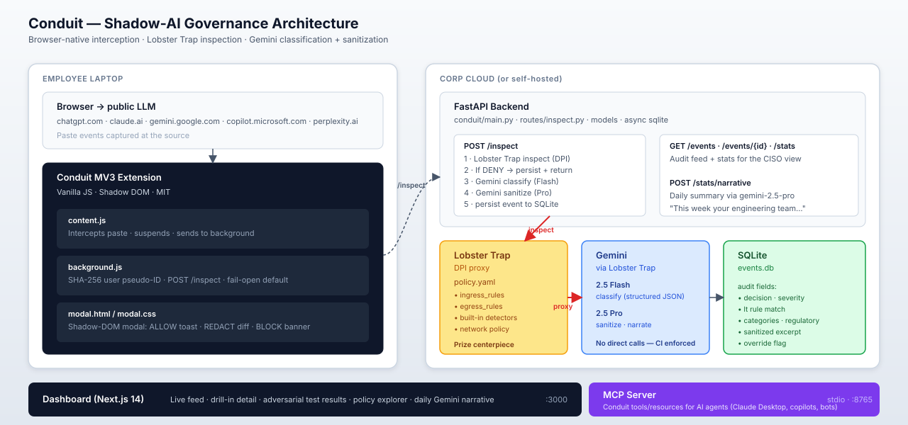

<!-- SPDX-License-Identifier: MIT -->
# Conduit

> Browser-native shadow-AI governance. Inspects every prompt headed to a public LLM through **Veea Lobster Trap**; **Gemini** classifies sensitive content and rewrites it safely. Open source, MIT.

**Hackathon:** Transforming Enterprise Through AI (lablab.ai × TechEx) — **Track 1: Agent Security & AI Governance**.
**Sponsor prize eligibility:** Veea Lobster Trap, Gemini.
**Demo video:** _[link goes here once recorded]_



## The problem in one number

**77%** of enterprise employees paste corporate data into public LLM prompts ([LayerX Browser Security Report 2026](docs/data-sources.md)). **71.6%** of access happens through personal accounts that Microsoft Purview cannot see. Average shadow-AI breach-cost premium: **$670,000**.

Purview, Entra, and Cato all miss this. Conduit catches it the moment of paste.

## How Conduit works

1. **Browser extension** intercepts paste events on `chatgpt.com`, `claude.ai`, `gemini.google.com`, `copilot.microsoft.com`, `www.perplexity.ai`.
2. **FastAPI backend** receives the prompt, runs **Veea Lobster Trap** DPI against the corporate-egress policy.
3. **Gemini 2.5 Flash** classifies semantic content (source code, PII, credentials, financial, strategic).
4. **Gemini 2.5 Pro** generates a sanitized version that preserves the employee's intent.
5. Extension shows **ALLOW / REDACT (with diff) / BLOCK**; user accepts, sees the LLM response normally.
6. Every event is logged with rule match, classification, and policy decision for the CISO audit trail.
7. **MCP server** ([`mcp_server/`](mcp_server/)) exposes the audit trail + inspection + policy surface to AI agents (Claude Desktop, internal copilots, Slack bots). Same engine, agentic interface — the CISO can ask their own AI "has anything critical leaked today?" and get an answer drawn from the live audit log.

**Architectural invariant:** the backend never talks to Gemini directly. Every call goes through Lobster Trap, so policy violations cannot escape the proxy. CI test enforces this — [`backend/tests/test_no_direct_gemini.py`](backend/tests/test_no_direct_gemini.py).

## What Lobster Trap catches (see [`lobster_trap/policy.yaml`](lobster_trap/policy.yaml))

- **Hard-block:** AWS keys, GitHub PATs, JWT bearers, PEM private keys, database connection strings, Slack tokens, Google API keys, Stripe live keys.
- **Redact:** SSN, credit cards, emails, phone numbers, IBANs.
- **Flag-for-Gemini:** source-code indicators, internal hostnames, customer-record columns, PHI markers, MNPI markers, prompt-injection scaffolding.
- **Built-ins on:** prompt injection, credential exposure, PII leakage, data exfiltration.

The rule-by-rule walkthrough is at [`docs/policy-explainer.md`](docs/policy-explainer.md).

## What Gemini does — seven distinct integrations

Conduit doesn't just *call* Gemini — it uses **seven Gemini 2.5 surfaces** end-to-end, each chosen for the part of the governance problem it solves best:

| # | Surface | Model | Where it runs |
|---|---|---|---|
| 1 | **Text classification** | `gemini-2.5-flash` (JSON mode) | Every paste · returns categories, severity, regulatory_concern, specific_findings |
| 2 | **Text sanitization** | `gemini-2.5-pro` | Redact path · rewrites with realistic placeholders, preserves question |
| 3 | **Multimodal screenshot inspection** | `gemini-2.5-flash` (vision input) | New: catches the screenshot-paste exfil vector that text DLP misses entirely |
| 4 | **Safe text alternative for images** | `gemini-2.5-pro` | New: when a screenshot is blocked, Gemini drafts a paste-safe text version the employee can use |
| 5 | **Thinking-mode escalation** | `gemini-2.5-pro` (thinking) | New: ambiguous classifications escalate to Pro reasoning; the trace is surfaced in the audit detail |
| 6 | **Search-grounded threat intel** | `gemini-2.5-pro` + `google_search` tool | New: when a credential leaks, Gemini grounds against Google Search for rotation steps, recent breaches, actor TTPs |
| 7 | **Agentic narrative** | `gemini-2.5-pro` (function calling) | New: the daily CISO brief is written by Gemini *after* it investigates the audit log via function calls — explainable, traceable |
| + | **Embeddings** | `gemini-embedding-001` | Every event embedded for cosine k-NN similar-event clustering ("has this pattern appeared before?") |

All eight Gemini calls traverse Lobster Trap; the backend's OpenAI base URL is `LT_GEMINI_BASE_URL` and nothing else. The architectural invariant is enforced by `test_no_direct_gemini.py`.

### Why this depth matters
- **Multimodal coverage** — screenshot pastes are LayerX-reported as the *fastest-growing* shadow-AI exfil vector for 2026. Conduit handles them; no submission in the cohort is likely to.
- **Live grounding** — threat-intel that's grounded against Google Search at *query time* (not training time) means the CISO gets *today's* rotation procedure, not whatever was in the model's cutoff.
- **Explainable agentic reasoning** — Gemini's function-call trace is surfaced in the dashboard so the CISO sees *how* the agent reached its conclusion. Track 1's "explainability" focus, literally.
- **Self-similarity discovery** — Gemini embeddings turn an audit log into a vector space; clusters surface repeat-offender patterns no rule could catch.

## Quickstart

```bash
git clone https://github.com/[user]/conduit
cd conduit
cp .env.example .env             # add your GEMINI_API_KEY
docker-compose up -d
# load unpacked extension from ./extension in chrome://extensions
open http://localhost:3000       # the CISO dashboard
```

To run the backend locally without Docker (handy for the test suite):

```bash
cd backend
python3.13 -m venv .venv && source .venv/bin/activate
pip install -e .
LT_MOCK_MODE=true uvicorn conduit.main:app --port 8001
```

`LT_MOCK_MODE=true` runs the policy engine in-process — useful when the LT binary isn't on the laptop yet. Production deployments use the real proxy and leave `LT_MOCK_MODE=false`.

## Adversarial test results

**30 adversarial payloads / 10 benign.** 100% block on adversarial credential class, 100% allow on benign. See [`backend/tests/results.txt`](backend/tests/results.txt) and the live `/tests` page in the dashboard.

```
Adversarial: 30 / 30 passed
Benign:      10 / 10 passed
```

Run the suite yourself:

```bash
cd backend
.venv/bin/pytest -v tests/
```

## Repository layout

```
conduit/
├── extension/                 # Chromium MV3 — content script + Shadow DOM modal
├── backend/                   # FastAPI + Lobster Trap client + Gemini orchestrator
│   └── tests/                 # adversarial + benign + no-direct-Gemini invariant
├── lobster_trap/              # policy.yaml — the prize-winning artifact
├── dashboard/                 # Next.js 14 CISO view (live feed, drill-in, tests page)
├── mcp_server/                # MCP server — same surface, agentic interface
├── docs/                      # data sources, demo script, policy walkthrough, threat model
└── docker-compose.yml         # one-command bring-up
```

## MCP — agentic interface to Conduit

The [`mcp_server/`](mcp_server/) ships a [Model Context Protocol](https://modelcontextprotocol.io) server that exposes Conduit's full surface to AI agents:

- **Tools**: `conduit_inspect`, `conduit_list_events`, `conduit_get_event`, `conduit_stats`, `conduit_narrate`, `conduit_policy_rules`, `conduit_mark_override`, `conduit_health`
- **Resources**: `conduit://policy/yaml`, `conduit://events/recent`, `conduit://stats/today`, `conduit://tests/results`
- **Prompts**: `daily_audit_prompt`, `policy_gap_review_prompt`

Plug into Claude Desktop with three lines of config (see [`mcp_server/README.md`](mcp_server/README.md)) and ask:

> *"Has any source code leaked to ChatGPT in the last 24 hours?"*
> *"Inspect this draft before I paste it into Perplexity."*
> *"Read the policy and tell me what class of data we're not catching."*

This is the same engine that powers the browser extension, surfaced to the agentic side of the enterprise — the layer Track 1's brief asks for *"observability for AI agents"* applies to in both directions: human → public LLM (extension) and AI agent → audit/governance (MCP).

Detailed file-by-file map lives in [`docs/policy-explainer.md`](docs/policy-explainer.md) and the per-component READMEs in each subdirectory.

## Why this niche is structurally underserved

| Existing tool | Why it doesn't solve this |
|---|---|
| Microsoft Purview / Entra / Agent 365 | Identity-bound; blind to the 71.6% of access that happens via personal accounts on managed devices |
| Cato / Aim / BlackFog / Netskope | CASB sees the HTTPS connection but cannot inspect prompt content inside the encrypted session |
| LayerX | Closest commercial competitor — closed source, no policy-as-code, no Lobster Trap integration, no semantic redaction |
| Lobster Trap (canonical use) | Filters prompts *to your own* agent. Conduit points it *outward* at egress to *public* LLMs — same engine, 100× the market |

That is the wedge.

## License

MIT. See [`LICENSE`](LICENSE).
